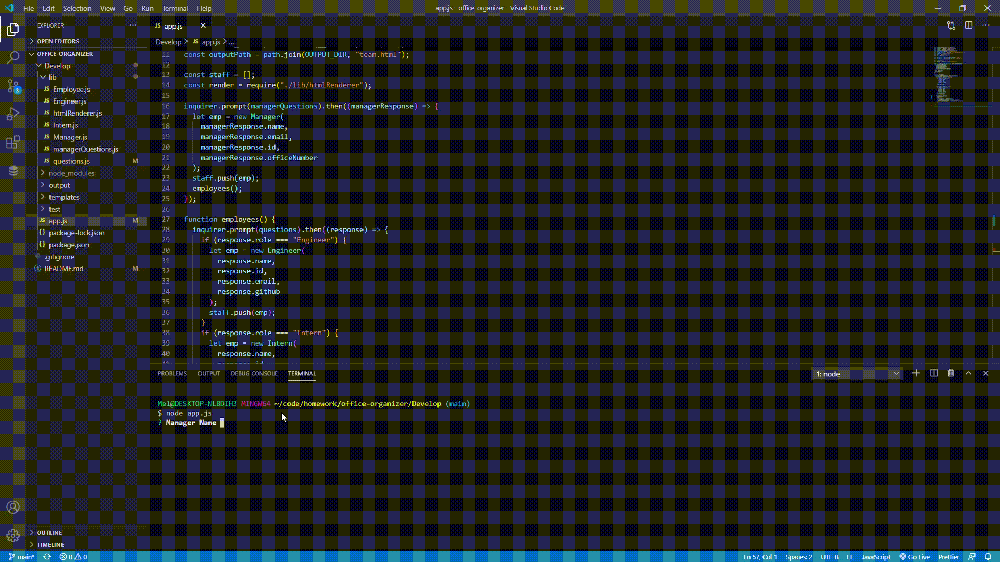

# Title: **Office Organizer**

&nbsp;
&nbsp;

## Description:

**This app allows you to add and remove employees and then display them to your screen with their own descriptive cards to be viewed in your browser**

&nbsp;
&nbsp;

## Installation:

_inquirer and jest are the 2 node packages you will need to install._

&nbsp;
&nbsp;

## Contributors:

**none**

&nbsp;
&nbsp;

## Test:

**open the app.js file in your terminal and follow the prompts.**

&nbsp;
&nbsp;

## License:

ISC

&nbsp;
&nbsp;

## License URL:

https://github.com/stevetrilogy/unit10hw/issues

&nbsp;
&nbsp;

## GitHub UserName:

@Rick-Smart

&nbsp;
&nbsp;

## Email:

**rick-s@hotmail.com**

&nbsp;
&nbsp;

# Screen Shots

&nbsp;
&nbsp;

&nbsp;
&nbsp;

&nbsp;
&nbsp;

# Video Clip

&nbsp;
&nbsp;

&nbsp;
&nbsp;
